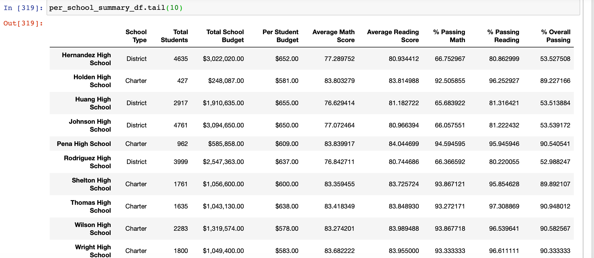

# School_District_Analysis

## Overview:
  Analyze the city school district data based on funding and standardized scores and provide insights into performance trends based on different parameters to make future decisions.

## Step 1: 
  Before doing the analysis, carefully combed through both school data and student data to see if there is any missing field or misentered value. After going through the data we figured out Student Name had some of the suffixes and prefixes as professional name or not a valid name so we did a cleanup of data using a pandas data frame
  
## Step 2:
  Merged both school and student data to get a complete view. Using School and Student data created some of the insights. Got the view of passing students in Math, Reading along with their percentage and overall passing where 70 is the passing score.
  Created per school summary based on budget to get insight into if the budget allocated to school have any impact on the performance. .
  Since per school summary view had a lot of data to consume, created the top 5 schools and bottom 5 schools based on the overall passing rate and the per-student budget allocated to see the correlation   
  Created bins to categorize the spending range or school size to see the insights into performance  
  Another perspective to the insights was created to look at school type and its impact on students performance 
  
