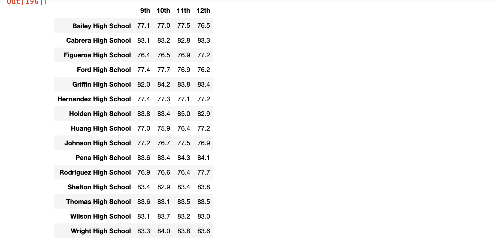
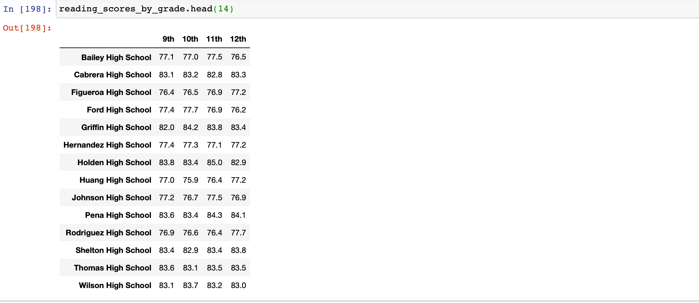
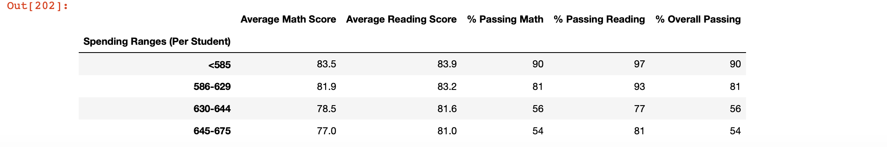
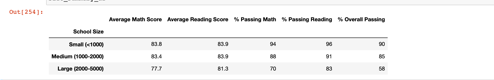

# School_District_Analysis

## Overview:
  Analyze the city school district data based on funding and standardized scores and provide insights into performance trends based on different parameters to make future decisions.

## Step 1: 
  Before doing the analysis, carefully combed through both school data and student data to see if there is any missing field or misentered value. After going through the data we figured out Student Name had some of the suffixes and prefixes as professional name or not a valid name so we did a cleanup of data using a pandas data frame
  
## Step 2:
  Merged both school and student data to get a complete view. Using School and Student data created some of the insights. Got the view of passing students in Math, Reading along with their percentage and overall passing where 70 is the passing score.
  Created per school summary based on budget to get insight into if the budget allocated to school have any impact on the performance. .
  Added insights into gradewise math and reading performance based on school  
  Since per school summary view had a lot of data to consume, created the top 5 schools and bottom 5 schools based on the overall passing rate and the per-student budget allocated to see the correlation   
  Created bins to categorize the spending range or school size to see the insights into performance  
  Another perspective to the insights was created to look at school type and its impact on students performance 
  
## Challenge:

### Overview:
   Thomas High School 9th grader math and reading scores reported is incorrect. Let's make an adjustment to the data and create the insights.
   
### Analysis:
   Since Thomas High School's 9th-grade math and reading scores were incorrect we replaced them with Not a number to adjust the analysis. Based on the district summary we could see the new perspective, though the average scores didn't change much the %passed math, %passed reading and %Overall passing dipped by 1%.[District Summary View](images/District_Summary_View_Challenge.png)
   Thomas High School's %Passing in math, reading, overall dropped to mid 60% while it was 90% before the adjustment. .
   Except the Thomas High School data was not there, there is no major change in the grade-wise math and reading scores. Thomas High School dropped from the top 5 
   Spending range wise student performance had an impact mainly on 630-644 per student category where %Passing Math, Reading, and Overall dropped approximately 6%.   whereas Student Size based performance dropped in %Passing Math, Reading and Overall by 5% 
    Charter school type %Passing Math, Reading, and Overall dropped approx. 4% due to Thomas High School 9th grade data 

### Conclusion:
   By replacing the value to NaN for the incorrect data %passing math, reading, overall not only impacted the School's data but district-wise data. Though the impact is small we were able to get insights into the city school's performance based on budget per student, size, school type. This would help the school district and supervisor's to make future decisions on how to improve performance. 
